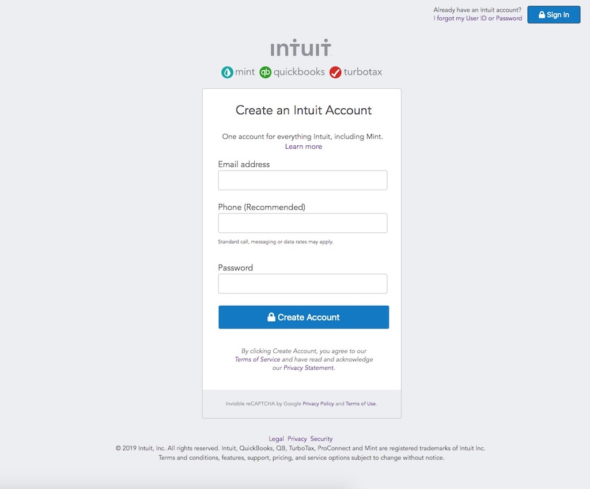

# HTML-forms

=======

## Microverse 2nd project

### Mint.com’s signup page clone

Project: HTML Forms
Forms are one of the most important parts of your site. They are your user’s gateway into your back end – the user provides data in a form and you do stuff with it.

Used:

- CSS FlexBox
- HTML5

## Authors

- Neto daniel Zinga https://github.com/dannyclever
- Nick Haralampopoulos https://github.com/macnick

## Screenshot

## The Website

Follow the link to acess to the Website: https://macnick.github.io/HTML-forms/
